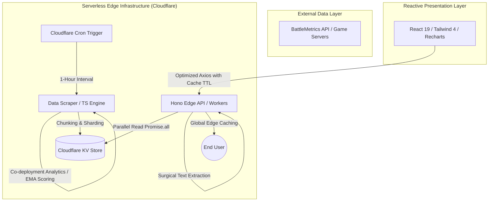

# 🛡️ Full-Stack Data Visualization & Edge-Native Leaderboard Platform
### High-Performance Mod Tracking, Analytics & Scalable Ranking System for Arma Community

[](https://reforgermods.com)
[]()
[]()
[](https://creativecommons.org/licenses/by-nc/4.0/)

A production-grade, ultra-high-performance data aggregation and visualization platform built to overcome the limitations of the official Arma Workshop. By analyzing active multiplayer server environments and player metrics, the system calculates real-time popularity index, retention, and community trends.

---

## 🚀 Key Engineering & Architectural Highlights

### 1. Zero-Overhead Co-Deployment Analytics
* **Problem**: Storing custom co-occurrence matrices for hundreds of mods in a serverless key-value store would exponentially increase Cloudflare KV transaction counts and storage costs.
* **Solution**: Developed a memory-optimized in-memory analytics engine inside the data collector. It calculates the top 5 co-deployed mods (frequently deployed together) and injects this metadata directly into pre-existing mod data shards.
* **Result**: Implemented complex graph-like association rule mining with **exactly zero (0) additional KV read or write operations**.

### 2. Exponential Moving Average (EMA) Server Scoring
* **Problem**: Traditional leaderboards cause rapid ranking drops during routine server restarts, leading to inaccurate metrics.
* **Solution**: Implemented an Exponential Moving Average (EMA) smoothing algorithm ($\alpha = 0.15$) for server score calculation. This weights historical performance at 85% and live statistics at 15%.
* **Result**: Eliminates rating fluctuations during maintenance, preventing false rank decays and providing a highly stable community index.

### 3. Distributed Sharding & Surgical JSON Extraction
* **Problem**: Cloudflare KV values are limited to 25MB and parsing huge JSON blobs on every request exceeds Worker CPU time limits (50ms).
* **Solution**: 
  - **Dynamic Sharding**: Mod data is distributed across multiple 5MB shards (sized optimized to avoid KV limits).
  - **Surgical Text Extraction**: Developed `findMatchingBrace`—a low-level string-scanning algorithm that slices target JSON objects directly out of raw text buffers.
* **Result**: Bypasses memory-heavy `JSON.parse` overhead, reducing global edge API latency to sub-10ms response times.

### 4. Enterprise-Grade SEO & OpenGraph Engine
* **Dynamic Hydration**: Using `react-helmet-async` on React 19 to deliver context-aware Title, Description, and Rich Snippets.
* **Metadata Integrity**: Automatic rich embeds generation for Discord, Twitter/X, and search engines.

---

## 🏗️ Architecture Overview



---

## 🛠️ Technology Stack

| Layer | Technologies | Architectural Intent |
| :--- | :--- | :--- |
| **Frontend** | React 19, Vite, Tailwind CSS v4, Recharts, TypeScript | Interactive telemetry, lightning-fast HMR, modular UI. |
| **Backend & API** | Hono, Node.js, Cloudflare Workers | Edge-native API microservices, ultra-low TTFB, Serverless runtime. |
| **Infrastructure** | Cloudflare Pages, Cloudflare KV, Cron Triggers | Multi-region edge deployment, resilient distributed storage. |
| **Data Scraping** | TypeScript, Axios, BattleMetrics REST API | Automated hourly data pipeline, ingestion, and validation. |

---

## 📉 Core Performance Optimization Strategies

### ⚡ Global API Edge Caching
Every static asset and expensive API route utilizes Cloudflare's Cache API with optimized Cache-Control headers. The browser acts as a secondary cache layer (TTL: 1-60m), ensuring navigation is instant and 0% edge CPU overhead is wasted on repeated queries.

### ⚡ Parallel KV Batching (`Promise.all`)
Rather than sequentially loading mod shards (which previously caused 503 gateway timeouts under heavy load), the API executes asynchronous concurrent fetches, processing massive data pools parallelly at the edge.

### ⚡ Defensive State & Race Condition Prevention
Implemented global `AbortController` cancellation in React. Rapid views switching instantly aborts unresolved network tasks, guaranteeing zero UI memory leaks and correct rendering of temporal data.

---

## 🛠️ Local Development & Deployment

### Prerequisites
- Node.js (v20+ recommended)
- Cloudflare Wrangler CLI (`npm i -g wrangler`)

### Step-by-Step Installation

1. **Clone the repository**
   ```bash
   git clone https://github.com/GrybasTV/armamods-leaderboard.git
   cd armamods-leaderboard
   ```

2. **Install Core & Client Dependencies**
   ```bash
   npm install
   cd web && npm install
   cd ..
   ```

3. **Configure Environment Variables**
   Create a `.env` file in the root directory:
    ```env
    PORT=3000
    BATTLEMETRICS_API_KEY=your_api_key_here
    CLOUDFLARE_API_TOKEN=your_cloudflare_api_token
    CLOUDFLARE_ACCOUNT_ID=your_id
    WORKER_URL=https://api.reforgermods.com
    ```

4. **Launch Local Services**
   * **Backend Proxy & Scraper Execution**:
     ```bash
     npm run dev
     ```
   * **Frontend Server**:
     ```bash
     cd web && npm run dev
     ```

---

## 🧪 Verification & Testing
To ensure the integrity of the math scoring models and surgical parser:
```bash
npm test
```
*Tested areas: `findMatchingBrace` surgical logic, EMA ranking decay correctness, SQE bonus clamping bounds.*

---

## 📝 License & Contact
Copyright © 2026 Paulius Medžiukevičius. Distributed under the [Creative Commons CC BY-NC 4.0](https://creativecommons.org/licenses/by-nc/4.0/) License. 
For inquiries or collaborations, please reach out via GitHub or [LinkedIn](https://www.linkedin.com/in/paulius-medziukevi%C4%8Dius-003586168/).


