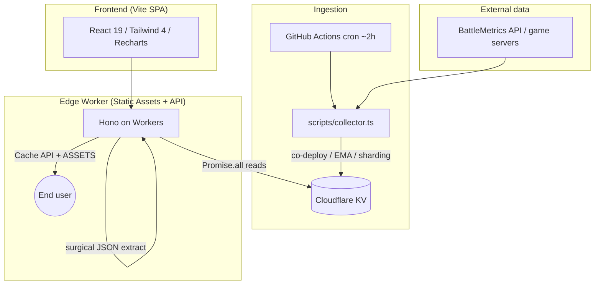

# Arma Reforger & Arma 3 Mod / Server Leaderboard

Edge-native popularity rankings from live multiplayer servers — Cloudflare Workers + KV, React, Hono.

**Live site:** [reforgermods.com](https://reforgermods.com/)

[](https://reforgermods.com/)
[](https://reforgermods.com/)
[_%7C_98_(mobile)-brightgreen.svg)](docs/LIGHTHOUSE.md)
[](docs/LIGHTHOUSE.md)
[](https://creativecommons.org/licenses/by-nc/4.0/)

Supplements the official Arma Workshop with engagement telemetry from active multiplayer servers: popularity index, retention signals, and community trends — not a workshop replacement.

---

## Engineering highlights

### 1. Low-overhead co-deployment analytics
* **Problem**: Co-occurrence matrices for hundreds of mods would spike Cloudflare KV ops and storage.
* **Solution**: In-memory analytics in the collector; top 5 co-deployed mods written into existing mod shards.
* **Result**: Association-style co-deploy data with **zero extra KV reads/writes**.

### 2. Exponential Moving Average (EMA) server scoring
* **Problem**: Rankings swing hard on routine server restarts.
* **Solution**: EMA ($\alpha = 0.10$) — 90% history, 10% live stats.
* **Result**: Stable ranks through maintenance windows.

### 3. Distributed sharding & surgical JSON extraction
* **Problem**: KV values max out at 25MB; full `JSON.parse` of large blobs burns Worker CPU (50ms budget).
* **Solution**:
  - **Dynamic sharding**: mod data across ~5MB shards.
  - **Surgical extract**: `findMatchingBrace` slices target objects from raw text.
* **Result**: Avoids heavy full-parse paths; cached API responses typically ~10–15ms.

### 4. SEO & Open Graph
* `react-helmet-async` on React 19 for context-aware title/description + **canonical**.
* Rich embeds for Discord, Twitter/X, and search; **Googlebot** gets prerendered mod/server HTML.
* JSON-LD (WebSite, ItemList, SoftwareApplication, HowTo) + dynamic `/sitemap.xml` index.
* Ops checklist: [docs/SEO.md](docs/SEO.md).

### 5. Workshop metadata supplement (not BattleMetrics)
* **Problem**: BattleMetrics has no thumbnails/deps; workshop has no live player telemetry.
* **Solution**: Reforger workshop metadata in KV (7d), filled by the collector warm pass and background refreshes — never scraped synchronously on the request path (cold reads answer instantly and warm in the background). List pages embed cached `author` / `thumbnail` / `workshopStatus`; row images via resized `/thumbnail/img?w=` proxy.
* **Result**: Recognition + install requirements without duplicating the catalog. See [docs/WORKSHOP_METADATA.md](docs/WORKSHOP_METADATA.md).

### 6. Scenario leaderboard
* Collector aggregates by `scenarioName` after SQE scoring → `cache:ranking:scenarios:{game}`.
* `GET /api/scenarios` + drill-down `GET /api/scenarios/servers?name=`; UI at `/scenarios`.

### 7. Console storage planner & modpack sizes
* Workshop sizes → KV; collector attaches `modpackEstimatedBytes`; **Storage Planner** (`/storage-planner`) for PS5/Xbox ~25 GB budgets.
* See [docs/STORAGE_PLANNER.md](docs/STORAGE_PLANNER.md).

### 8. Server uptime history (v1.22+)
* Online samples per collector run; days/weeks marked offline only when **&lt;50%** of scans saw the server up.
* See [docs/SERVER_UPTIME.md](docs/SERVER_UPTIME.md).

### 9. Client-side favorites (v1.22+)
* `localStorage` favorites (up to 20 per game for mods and servers); pinned blocks on list pages. Zero backend cost.

### 10. One-click mod config copy (v1.21+)
* `CopyModConfigButton` / full modpack copy — clipboard-ready `config.json` fragments.

### 11. Surgical mod lookup (`mod-lookup.ts`, v1.22.1)
* Avoids matching a mod ID inside another mod’s `coDeployed` array (false `#-` ranks).
* Tests: `test/mod-lookup.test.ts`.

---

## Architecture


```mermaid
graph TD
    subgraph "External data"
        BM[BattleMetrics API / game servers]
    end

    subgraph "Ingestion"
        GHA[GitHub Actions cron ~2h] --> COL[scripts/collector.ts]
        COL --> |co-deploy / EMA / sharding| KV[(Cloudflare KV)]
    end

    subgraph "Edge Worker (Static Assets + API)"
        API[Hono on Workers] --> |Promise.all reads| KV
        API --> |surgical JSON extract| API
        API --> |Cache API + ASSETS| User((End user))
    end

    subgraph "Frontend (Vite SPA)"
        WEB[React 19 / Tailwind 4 / Recharts] --> API
    end

    BM --> COL
```

Collector schedule: `.github/workflows/collector.yml` (`0 */2 * * *`). Deploy via Cloudflare Workers Builds (push į `main` → `web/dist` build + `wrangler deploy` Cloudflare pusėje; buvęs Pages deploy pašalintas 2026-08-24). Ops: [docs/DATA_SYNC.md](docs/DATA_SYNC.md).

---

## Stack

| Layer | Technologies | Role |
| :--- | :--- | :--- |
| **Frontend** | React 19, Vite, Tailwind CSS v4, Recharts, TypeScript | Leaderboards, charts, client cache (served via Workers Assets) |
| **API** | Hono on Cloudflare Workers (unified `web/worker.ts` + `assets` + `run_worker_first`) | Edge reads, workshop scrape, sitemap, share prerender, caching |
| **Storage** | Cloudflare KV (`TRENDING_KV`) | Sharded rankings, history, metadata |
| **Ingestion** | TypeScript collector, BattleMetrics REST, GitHub Actions | Cron ~2h collect + trending |

---

## Performance notes

### Edge + browser caching
Static assets and expensive API routes use Cloudflare Cache API and Cache-Control (browser TTL 1–60m) so repeat navigation avoids redundant Worker work.

### Parallel KV batching (`Promise.all`)
Mod shards load concurrently instead of sequentially (sequential loads previously caused gateway timeouts under load).

### AbortController on navigation
Rapid view switches abort in-flight requests to avoid stale renders and leaked work.

### Lighthouse / PageSpeed (production, Jul 2026)

Mod leaderboard at `https://reforgermods.com/` — [PageSpeed Insights](https://pagespeed.web.dev/analysis?url=https://reforgermods.com/) after v1.21 list-metadata work:

| | Desktop | Mobile (Slow 4G) |
|--|---------|------------------|
| Performance | **100** | **98** |
| Accessibility | 98 | 94 |
| Best Practices | 100 | 100 |
| SEO | 100 | 100 |

TBT **970 ms → 0 ms** (desktop) by collapsing ~72 per-row API calls into one `GET /api/mods`. Details: [docs/LIGHTHOUSE.md](docs/LIGHTHOUSE.md).

---

## Local development

### Prerequisites
- Node.js (v20+ recommended)
- Cloudflare Wrangler CLI (`npm i -g wrangler`)

### Setup

1. **Clone**
   ```bash
   git clone https://github.com/pauliusmed/armamods-leaderboard.git
   cd armamods-leaderboard
   ```

2. **Install**
   ```bash
   npm install
   cd web && npm install
   cd ..
   ```

3. **Environment**
   Create a `.env` in the repo root:
    ```env
    PORT=3000
    BATTLEMETRICS_API_KEY=your_api_key_here
    CLOUDFLARE_API_TOKEN=your_cloudflare_api_token
    CLOUDFLARE_ACCOUNT_ID=your_id
    WORKER_URL=https://api.reforgermods.com
    ```
   `BATTLEMETRICS_API_KEY` is a **paid** BattleMetrics PAT (required since ~2026-07-20). Without it the GitHub collector cannot refresh KV.
   Ops: [docs/DATA_SYNC.md](docs/DATA_SYNC.md).

4. **Run**
   * Full Worker (API + SPA, production parity): `npx wrangler dev --cwd web --local` (build `web` first via `npm --prefix web run build`).
   * Frontend only: `cd web && npm run dev`
   * Legacy proxy (deprecated): `npm run dev` → proxies to production Worker.

---

## Tests

```bash
npm test
```

Coverage includes surgical JSON extract, `mod-lookup`, EMA/SQE ranking, scenario aggregation, storage planner, server uptime history, audit-config, history-query, share-meta, search-match.

**Docs:** [walkthrough.md](walkthrough.md) · [docs/DATA_SYNC.md](docs/DATA_SYNC.md) · [docs/LIGHTHOUSE.md](docs/LIGHTHOUSE.md) · [docs/ALGORITHM.md](docs/ALGORITHM.md) · [docs/STORAGE_PLANNER.md](docs/STORAGE_PLANNER.md) · [docs/SERVER_UPTIME.md](docs/SERVER_UPTIME.md) · [docs/UI_FILTERS.md](docs/UI_FILTERS.md) · [docs/WORKSHOP_METADATA.md](docs/WORKSHOP_METADATA.md) · [docs/PERFORMANCE.md](docs/PERFORMANCE.md) · [docs/ARCHITECTURE_DECISION.md](docs/ARCHITECTURE_DECISION.md) · [docs/README.md](docs/README.md) · [CHANGELOG.md](CHANGELOG.md) (through **v1.22.13**) · [PLAN.md](PLAN.md) (Current / Next).

## License & contact
Copyright © 2026 Paulius Medžiukevičius. [Creative Commons CC BY-NC 4.0](https://creativecommons.org/licenses/by-nc/4.0/).
GitHub or [LinkedIn](https://www.linkedin.com/in/paulius-medziukevi%C4%8Dius-003586168/).
